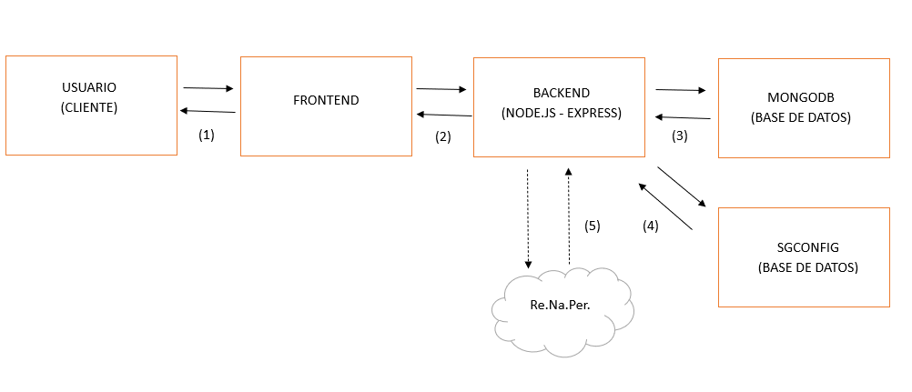

# Arquitectura del sistema

## 3.1 Diagrama de arquitectura  

### **Frontend**  
- **React** gestiona la interfaz de usuario y las interacciones.  
- **Ant Design** proporciona los componentes visuales para una experiencia consistente.  

### **Backend (Node.js)**  
- **Node.js y Express.js** gestionan las peticiones y la lógica de negocio.  
- **MongoDB** almacena la información de los usuarios, roles y permisos.  
- **Keycloak** se encarga de la autenticación y gestión de identidad.  

### **Comunicación Frontend-Backend**  
- El frontend hace peticiones HTTP (**RESTful API**) a los endpoints definidos en el backend.  
- Se pueden utilizar librerías como **Axios** o **Fetch** para realizar las peticiones.  

---

## 3.2 Diagrama de flujo de datos  

#### Flujo de Datos entre Usuario, Frontend, Backend y Base de Datos

**Usuario** interactúa con la UI del **Frontend** (hace clics, llena formularios, envía datos).  
**Frontend** envía peticiones HTTP al **Backend** (REST API).  
**Backend** procesa la lógica de negocio y consulta la Base de Datos (**MongoDB**).  
**MongoDB** responde con los datos solicitados o almacena nuevos datos.  
**Backend** envía la respuesta al **Frontend**.  
**Frontend** actualiza la UI con los datos recibidos.  
**Backend** envía peticiones a la BD **SGCONFIG**, tabla **CORREOS** para obtener datos de **usuarios** al momento de la carga.
**Backend** envía peticiones al WS de Re.Na.Per para validar datos del usuario, mediante **Nro. Documento** y **Género**

